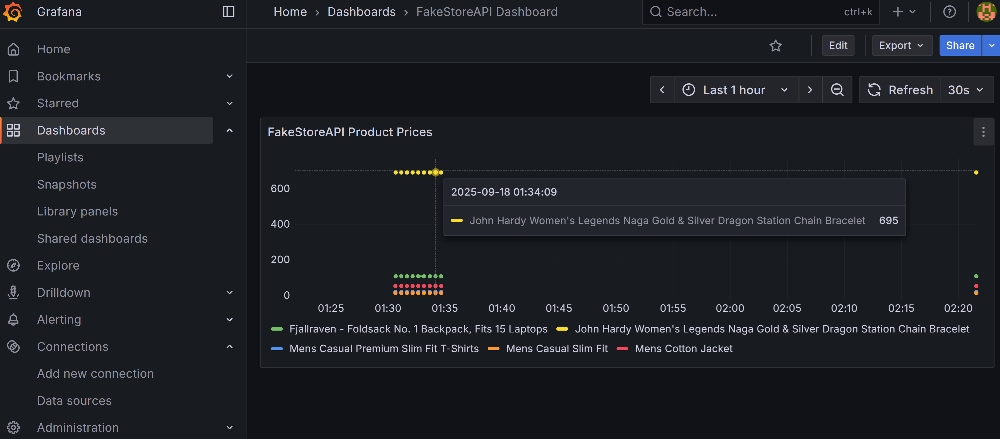

---

# Concurrent Web Scraper & Analytics Engine

## Overview

This project is a concurrent web scraper built in Go. It scrapes product prices from **FakeStoreAPI** (testing), stores data in PostgreSQL, and provides a REST API. Price trends can be visualized using Grafana.
## Grafana Example

Here is an example of the scraper dashboard in Grafana:


---

## Requirements

* Go 1.24+
* Docker & Docker Compose
* PostgreSQL 15+

---

## Installation

1. **Clone the repository**

```bash
git clone git@github.com:Witnot/scraper.git
cd scraper
```

2. **Create environment file**

```bash
cp .env.example .env
# Edit values if needed
```

3. **Build and run with Docker Compose**

```bash
docker compose up --build
```

* PostgreSQL runs on port `5432`
* REST API runs on port `8080`
* Grafana runs on port `3000`

---

## Usage

* Access REST API endpoints:

  * `GET /products` → list all products
  * `GET /products/:id/prices` → product price history
  * `GET /reports/price-trend` → aggregated price trends

* Access Grafana dashboard:

  ```
  http://localhost:3000
  ```

  * Data source: `scraper-postgres`
  * Dashboard shows price trends over time.
---

## Grafana Setup

1. **Add PostgreSQL as a Data Source**

* Go to **Settings → Data Sources → Add data source → PostgreSQL**
* Fill in the fields:

| Name     | Value         |
| -------- | ------------- |
| Name     | Postgres      |
| Host     | postgres:5432 |
| Database | scraper       |
| User     | postgres      |
| Password | postgres      |
| SSL Mode | disable       |

* Click **Save & Test** → you should see **Data source is working**.

2. **Create Dashboard**

* Go to **Create → Import → Upload JSON file**
* Use the provided `dashboardimport.json`
* The dashboard will display product price trends from your scraper.

---


## Adding Products

* Edit `main.go` and update the `targets` slice with FakeStoreAPI product URLs for testing.

---

## Notes

* Scraper uses goroutines for concurrency
* Scheduler runs scraping every 30 seconds
* This setup is **for testing only** —

---


